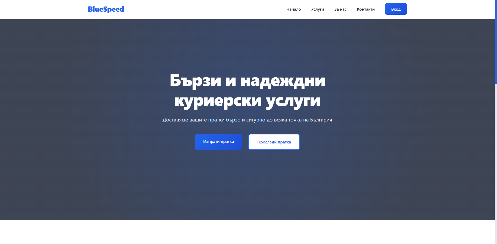

# 🚀 BlueSpeed - Куриерска система



## 📝 Описание

BlueSpeed е модерна уеб базирана система за управление на куриерски услуги. Платформата предлага интуитивен интерфейс за изпращане и проследяване на пратки, както и административен панел за управление на цялостния процес на доставка.

## ✨ Функционалности

### 👤 Потребителски интерфейс
- 📦 Изпращане на пратки
- 🔍 Проследяване на пратки в реално време
- 👤 Потребителски акаунт с история на пратките
- 📱 Отзивчив дизайн за всички устройства

### 👨‍💼 Административен панел
- 📊 Табло с ключови показатели
- 📦 Управление на пратки
- 👥 Управление на потребители
- 📈 Генериране на отчети
- ⚙️ Системни настройки

## 🛠️ Технологии

- **Frontend:**
  - HTML5
  - CSS3 (с модерни анимации и преходи)
  - JavaScript (ES6+)
  - Font Awesome икони
  - Responsive дизайн

- **Backend:**
  - PHP
  - MySQL база данни
  - RESTful API архитектура

## 🚀 Инсталация

1. Клонирайте репозиторито:
```bash
git clone https://github.com/MaciPatrona/BlueSpeed.git
```

2. Създайте база данни и импортирайте `database.sql`

3. Конфигурирайте връзката с базата данни в `config/database.php`

4. Стартирайте локален сървър:
```bash
php -S localhost:8000
```

## 📁 Структура на проекта

```
BlueSpeed/
├── admin/              # Административен панел
├── assets/            # Статични файлове
│   ├── css/          # CSS файлове
│   ├── js/           # JavaScript файлове
│   └── images/       # Изображения
├── config/           # Конфигурационни файлове
├── includes/         # PHP компоненти
├── api/             # API endpoints
└── README.md        # Документация
```

## 🔒 Сигурност

- Защитена автентикация
- Валидация на всички входни данни
- Защита срещу SQL инжекции
- CSRF защита
- XSS защита

## 🤝 Принос

1. Форкнете проекта
2. Създайте нов branch (`git checkout -b feature/AmazingFeature`)
3. Направете commit на промените (`git commit -m 'Add some AmazingFeature'`)
4. Пушнете към branch-а (`git push origin feature/AmazingFeature`)
5. Отворете Pull Request

## 📝 Лиценз

Този проект е лицензиран под MIT лиценза - вижте [LICENSE](LICENSE) файла за детайли.

## 📞 Контакти

- 📧 Email: info@bluespeed.bg
- 🌐 Website: [www.bluespeed.bg](https://www.bluespeed.bg)
- 📱 Телефон: +359 888 123 456

## 🙏 Благодарности

- Всички контрибутори, които са помогнали за развитието на проекта
- Font Awesome за иконите
- Всички тестери и потребители за обратната връзка

---

⭐ Star този проект ако ви е харесал! 
